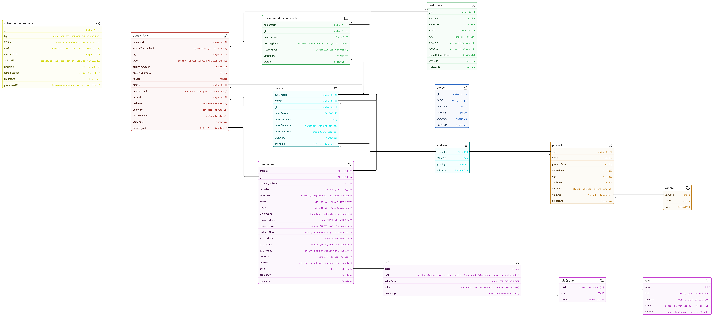

# Cashback Rewards System (L1)

An e-commerce cashback rewards platform: an admin dashboard for managing stores,
cashback campaigns, and customers, backed by a rule-driven cashback engine with a
timezone-aware scheduler for delayed delivery and expiry.

**Live demo:** https://fluffy-lamp-peach.vercel.app/

---

## Tech stack

**Backend** — Node.js, Express 5, TypeScript , Mongoose (MongoDB), Zod for
validation, dayjs for timezone math, node-cron for the in-process scheduler heartbeat.

**Frontend** — Vite, React 19, TypeScript, CSS Modules, TanStack Query (server state),
Zustand (client state), lucide-react (icons), sonner (toasts).

---

## Schema



Entity-relationship diagram of the 8 MongoDB collections; tiers and the rule tree are
embedded within `campaigns`.

---

## Prerequisites

- Node.js 20.19+ or 22+ (required by Vite 8).
- A MongoDB database — local `mongod`, or a MongoDB Atlas cluster.

---

## Environment variables

### Backend (`backend/.env` — see `backend/.env.example`)

| Variable        | Required | Default                 | Description                                      |
| --------------- | -------- | ----------------------- | ------------------------------------------------ |
| `MONGODB_URI`   | yes      | —                       | MongoDB connection string (local or Atlas SRV).  |
| `PORT`          | no       | `4000`                  | API port.                                        |
| `BASE_CURRENCY` | no       | `USD`                   | Base currency for stored/aggregated money.       |
| `CORS_ORIGIN`   | no       | `http://localhost:5173` | Allowed origin(s); comma-separated for multiple. |
| `NODE_ENV`      | no       | `development`           | `development` \| `test` \| `production`.         |

### Frontend (`frontend/.env`)

| Variable       | Required | Default                     | Description                  |
| -------------- | -------- | --------------------------- | ---------------------------- |
| `VITE_API_URL` | no       | `http://localhost:4000/api` | Base URL of the backend API. |

---

## Setup & running

### Backend

```bash
cd backend
npm install
cp .env.example .env      # then set MONGODB_URI
npm run seed              # populate sample stores/customers/products/campaigns
npm run dev               # start the API (tsx watch) on http://localhost:4000
```

Other scripts:

| Command             | Description                                      |
| ------------------- | ------------------------------------------------ |
| `npm run build`     | Compile TypeScript to `dist/`.                   |
| `npm start`         | Run the compiled server (`node dist/server.js`). |
| `npm run typecheck` | Type-check without emitting.                     |
| `npm run seed`      | Reset all collections and insert sample data.    |

### Frontend

```bash
cd frontend
npm install
npm run dev               # Vite dev server on http://localhost:5173
```

Other scripts:

| Command           | Description                          |
| ----------------- | ------------------------------------ |
| `npm run build`   | Type-check and build for production. |
| `npm run preview` | Preview the production build.        |
| `npm run lint`    | Run ESLint.                          |

---

## Database seeding

`npm run seed` (in `backend/`) connects using `MONGODB_URI`, **clears every collection**,
then inserts sample stores, customers, products, and campaigns. To seed a hosted DB, point
`MONGODB_URI` at it first:

```bash
MONGODB_URI="<your-atlas-uri>" npm run seed
```

> ⚠️ The seed is destructive — do not run it against a database with data you want to keep.
> MongoDB creates the database, collections, and Mongoose indexes automatically on first use.

---

## API reference

Base path: `/api`. All responses use a `{ data }` / `{ error }` envelope; money is
serialized as a string with its currency.

| Method     | Path                                   | Description                                          |
| ---------- | -------------------------------------- | ---------------------------------------------------- |
| GET        | `/health`                              | Liveness + DB connection state.                      |
| GET        | `/reference`                           | Currencies, timezones, FX rates.                     |
| GET        | `/fact-catalog`                        | Eligibility facts for the rule editor.               |
| GET / POST | `/stores`                              | List / create stores.                                |
| GET        | `/stores/:id`                          | Store detail.                                        |
| GET / POST | `/stores/:storeId/campaigns`           | List / create a store's campaigns.                   |
| GET        | `/campaigns/:id`                       | Campaign detail.                                     |
| PUT        | `/campaigns/:id`                       | Update a campaign.                                   |
| DELETE     | `/campaigns/:id`                       | Archive a campaign (soft delete via `archivedAt`).   |
| GET        | `/products`                            | List products.                                       |
| POST       | `/orders/process`                      | Process an order and trigger cashback.               |
| GET        | `/customers`                           | List customers.                                      |
| GET        | `/customers/:id`                       | Customer detail.                                     |
| GET        | `/customers/:id/balance`               | Customer balance (optionally in a display currency). |
| GET        | `/customers/:id/transactions?type=...` | Filterable transaction ledger.                       |
| POST       | `/scheduler/tick`                      | Run one scheduler tick (delivery/expiry).            |
| GET        | `/scheduler/pending`                   | Inspect pending/processing/failed operations.        |

---

## Scheduler

Delayed delivery and expiry are persisted as `scheduled_operations` and processed by a
worker (`runTick`), which is triggered by `POST /api/scheduler/tick`. The in-process
`node-cron` heartbeat (see `server.ts`) is commented out; in the deployed demo a MongoDB
Atlas Scheduled Trigger calls the tick endpoint on a schedule.
